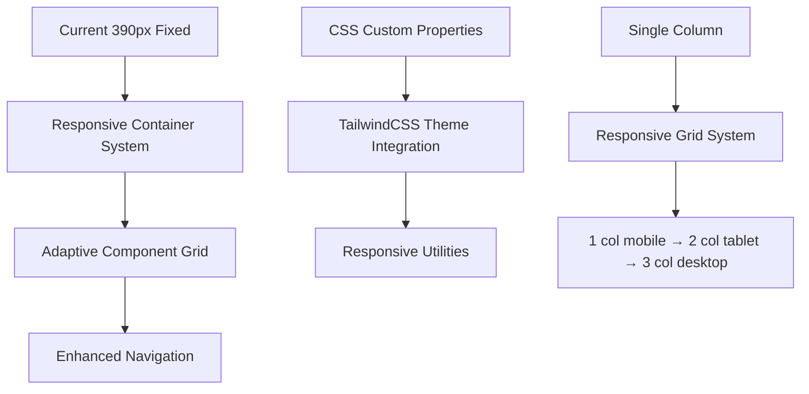

# 📱 Figma Design System - Responsive Enhancement Plan

## 🎯 **Project Overview**

**Current State**: Fixed 390px mobile-first design with beautiful Figma design system
**Goal**: Transform into a modern responsive webapp that scales beautifully across all devices
**Strategy**: Progressive enhancement with TailwindCSS integration

## 📊 **Current Analysis**

### **Strengths**
- ✅ Beautiful Figma design system with consistent tokens
- ✅ Well-structured component architecture
- ✅ Perfect mobile implementation (390px)
- ✅ TailwindCSS v4 already installed
- ✅ Clean CSS custom properties

### **Issues to Address**
- ❌ Fixed 390px container on all screen sizes
- ❌ No responsive breakpoints
- ❌ Wasted space on tablets/desktop
- ❌ Single-column layout only
- ❌ Bottom navigation doesn't adapt

## 🎨 **Responsive Design Strategy**

### **Breakpoint System**
```css
Mobile:    320px - 767px   (Primary focus - current Figma design)
Tablet:    768px - 1023px  (Enhanced layout with grid)
Desktop:   1024px+         (Optimized experience)
```

### **Progressive Enhancement Philosophy**
1. **Mobile-First**: Start with 390px Figma design (preserve existing)
2. **Scale Up**: Add enhancements for larger screens
3. **Touch-First**: Maintain mobile usability on all devices
4. **Performance**: No compromise on mobile performance

## 🏗️ **Implementation Architecture**



## 🔧 **Phase 1: Foundation (TailwindCSS Integration)**

### **Step 1.1: TailwindCSS Theme Configuration**
Create custom theme extending Figma design tokens:

```javascript
// tailwind.config.js
module.exports = {
  theme: {
    extend: {
      colors: {
        figma: {
          'bg-dark': '#12211A',
          'text-white': '#FFFFFF', 
          'accent-green': '#94C7AD',
          'card-bg': '#1A3326',
          'border': '#244736',
          'button-green': '#14B866',
          'input-bg': '#244736',
        }
      },
      fontFamily: {
        'figma': ['Lexend', 'sans-serif'],
      },
      spacing: {
        'figma': {
          'xs': '4px',
          'sm': '8px', 
          'base': '16px',
          'lg': '20px',
          'xl': '24px',
        }
      },
      screens: {
        'figma-sm': '390px',  // Figma base
        'figma-md': '768px',  // Tablet
        'figma-lg': '1024px', // Desktop
      }
    }
  }
}
```

### **Step 1.2: Responsive Container System**
Transform fixed container to responsive:

```typescript
// Enhanced FigmaLayout.tsx
const FigmaLayout = ({ children }) => (
  <div className="
    min-h-screen bg-gray-900 
    p-4 md:p-6 lg:p-8
    flex justify-center items-start
  ">
    <div className="
      w-full 
      max-w-[390px] md:max-w-2xl lg:max-w-4xl xl:max-w-6xl
      bg-figma-bg-dark 
      rounded-none md:rounded-xl lg:rounded-2xl
      overflow-hidden 
      shadow-none md:shadow-2xl
      min-h-screen md:min-h-[600px]
    ">
      {children}
    </div>
  </div>
);
```

## 🧩 **Phase 2: Component Responsiveness**

### **Step 2.1: Responsive Plant Cards**
Transform single cards to responsive grid items:

```typescript
// Enhanced FigmaPlantCard.tsx
const FigmaPlantCard = ({ plant }) => (
  <div className="
    flex justify-between items-center gap-4 p-4
    md:flex-col md:text-center md:p-6
    lg:hover:bg-figma-card-bg/30 lg:transition-all lg:duration-200
    cursor-pointer rounded-lg md:rounded-xl
    border-b border-figma-border md:border md:border-figma-border
  ">
    {/* Plant Info */}
    <div className="flex-1 md:order-2 space-y-1">
      <p className="text-sm text-figma-accent-green">
        {plant.lastWatered}
      </p>
      <h3 className="
        text-base font-bold text-figma-text-white 
        md:text-lg lg:text-xl
      ">
        {plant.name}
      </h3>
      <p className="text-sm text-figma-accent-green md:text-base">
        {plant.wateringStatus}
      </p>
    </div>
    
    {/* Plant Image */}
    
  </div>
);
```

### **Step 2.2: Responsive Plant List Grid**
Create adaptive grid system:

```typescript
// Enhanced FigmaPlantList.tsx
const FigmaPlantList = ({ plants, onPlantClick }) => (
  <div className="
    /* Mobile: Single column list */
    space-y-0 divide-y divide-figma-border
    
    /* Tablet: 2-column grid */
    md:grid md:grid-cols-2 md:gap-4 md:space-y-0 md:divide-y-0 md:p-4
    
    /* Desktop: 3-column grid */
    lg:grid-cols-3 lg:gap-6 lg:p-6
    
    /* Large Desktop: 4-column grid */
    xl:grid-cols-4
  ">
    {plants.map(plant => (
      <FigmaPlantCard 
        key={plant.id} 
        plant={plant} 
        onClick={() => onPlantClick(plant.id)}
      />
    ))}
  </div>
);
```

## 🧭 **Phase 3: Navigation Enhancement**

### **Step 3.1: Adaptive Bottom Navigation**
Enhance for larger screens:

```typescript
// Enhanced FigmaBottomNav.tsx
const FigmaBottomNav = ({ items }) => (
  <nav className="
    bg-figma-card-bg border-t border-figma-border
    p-2 md:p-4
    /* Hide on large desktop, replace with sidebar */
    xl:hidden
  ">
    <div className="flex justify-around items-center max-w-md mx-auto">
      {items.map(item => (
        <button className="
          flex flex-col items-center gap-1 p-2 min-w-[60px]
          md:flex-row md:gap-2 md:px-4 md:min-w-[100px]
          text-figma-accent-green hover:text-figma-text-white
          transition-colors duration-200
          focus:outline-none focus:ring-2 focus:ring-figma-accent-green
        ">
          <Icon name={item.icon} className="w-6 h-6 md:w-5 md:h-5" />
          <span className="text-xs md:text-sm font-medium">
            {item.label}
          </span>
        </button>
      ))}
    </div>
  </nav>
);
```

### **Step 3.2: Desktop Sidebar (Optional)**
Add sidebar for large screens:

```typescript
// New: FigmaDesktopSidebar.tsx
const FigmaDesktopSidebar = ({ currentPath }) => (
  <aside className="
    hidden xl:flex xl:flex-col xl:w-64 
    xl:bg-figma-card-bg xl:border-r xl:border-figma-border
    xl:p-6 xl:min-h-screen
  ">
    {/* Logo/Brand */}
    <div className="mb-8">
      <h1 className="text-xl font-bold text-figma-text-white">
        Plant Manager
      </h1>
      <p className="text-sm text-figma-accent-green mt-1">
        Figma Design System
      </p>
    </div>
    
    {/* Navigation */}
    <nav className="space-y-2 flex-1">
      {navItems.map(item => (
        <Link
          to={item.href}
          className={`
            flex items-center gap-3 p-3 rounded-lg
            transition-all duration-200
            ${currentPath === item.href 
              ? 'bg-figma-bg-dark text-figma-text-white' 
              : 'text-figma-accent-green hover:bg-figma-bg-dark/50'
            }
          `}
        >
          <Icon name={item.icon} className="w-5 h-5" />
          <span className="font-medium">{item.label}</span>
        </Link>
      ))}
    </nav>
  </aside>
);
```

## 📝 **Phase 4: Forms & Input Enhancement**

### **Step 4.1: Responsive Form Layouts**
Optimize forms for different screen sizes:

```typescript
// Enhanced FigmaFormField.tsx
const FigmaFormField = ({ label, children, className, fullWidth = false }) => (
  <div className={`
    space-y-2 p-3
    md:p-4 md:space-y-3
    lg:p-6 lg:space-y-4
    ${className}
  `}>
    <label className="
      block text-base font-medium text-figma-text-white
      md:text-lg lg:text-xl
    ">
      {label}
    </label>
    <div className={`
      w-full
      ${!fullWidth ? 'md:max-w-md lg:max-w-lg' : ''}
    `}>
      {children}
    </div>
  </div>
);
```

### **Step 4.2: Enhanced Input Components**
Add responsive styling to inputs:

```typescript
// Enhanced FigmaInput.tsx
const FigmaInput = ({ className, ...props }) => (
  <input
    className={`
      w-full h-14 px-4
      bg-figma-input-bg border-none rounded-xl
      text-figma-text-white placeholder-figma-accent-green
      font-figma text-base
      
      md:h-16 md:px-6 md:text-lg
      lg:h-18 lg:text-xl
      
      focus:outline-none focus:ring-2 focus:ring-figma-accent-green
      transition-all duration-200
      
      ${className}
    `}
    {...props}
  />
);
```

## 🎨 **Phase 5: Typography & Spacing Scale**

### **Step 5.1: Responsive Typography System**
Create fluid typography that scales:

```css
/* Enhanced typography classes */
.figma-text-h1 {
  @apply font-figma font-bold leading-tight text-figma-text-white;
  @apply text-lg md:text-xl lg:text-2xl xl:text-3xl;
}

.figma-text-h2 {
  @apply font-figma font-bold leading-tight text-figma-text-white;
  @apply text-xl md:text-2xl lg:text-3xl xl:text-4xl;
}

.figma-text-body {
  @apply font-figma leading-normal text-figma-text-white;
  @apply text-base md:text-lg lg:text-xl;
}

.figma-text-small {
  @apply font-figma leading-normal text-figma-text-white;
  @apply text-sm md:text-base lg:text-lg;
}
```

### **Step 5.2: Responsive Spacing System**
Create consistent spacing that adapts:

```css
/* Responsive spacing utilities */
.figma-p-responsive {
  @apply p-4 md:p-6 lg:p-8 xl:p-10;
}

.figma-gap-responsive {
  @apply gap-4 md:gap-6 lg:gap-8;
}

.figma-mb-responsive {
  @apply mb-4 md:mb-6 lg:mb-8;
}
```

## 📊 **Responsive Behavior Matrix**

| Component | Mobile (390px) | Tablet (768px+) | Desktop (1024px+) | Large (1440px+) |
|-----------|----------------|-----------------|-------------------|-----------------|
| **Container** | Fixed 390px | Fluid max-2xl | Fluid max-4xl | Fluid max-6xl |
| **Plant Cards** | Single column | 2-column grid | 3-column grid | 4-column grid |
| **Navigation** | Bottom nav | Enhanced bottom | Bottom nav | Sidebar option |
| **Typography** | Base sizes | +1 scale | +2 scale | +3 scale |
| **Spacing** | Compact (16px) | Comfortable (24px) | Spacious (32px) | Luxurious (40px) |
| **Images** | 70px | 96px | 128px | 160px |
| **Borders** | Sharp | Rounded-xl | Rounded-2xl | Rounded-3xl |

## 🎯 **Success Criteria**

### **Performance Metrics**
- [ ] Maintains 60fps on mobile devices
- [ ] Fast loading on 3G networks (< 3s)
- [ ] Efficient CSS bundle size (< 50KB gzipped)
- [ ] No layout shift during responsive transitions

### **Usability Standards**
- [ ] Touch targets ≥44px on mobile
- [ ] Readable text at all screen sizes (min 16px)
- [ ] Intuitive navigation on all devices
- [ ] Consistent visual hierarchy across breakpoints

### **Accessibility Requirements**
- [ ] WCAG 2.1 AA compliance
- [ ] Keyboard navigation support
- [ ] Screen reader compatibility
- [ ] High contrast ratios maintained

### **Browser Support**
- [ ] Modern browsers (Chrome, Firefox, Safari, Edge)
- [ ] Mobile browsers (iOS Safari, Chrome Mobile)
- [ ] Tablet browsers (iPad Safari, Android Chrome)

## 🚀 **Implementation Timeline**

### **Week 1: Foundation**
- [ ] TailwindCSS theme configuration
- [ ] Responsive container system
- [ ] Basic breakpoint testing

### **Week 2: Components**
- [ ] Plant card responsiveness
- [ ] Grid system implementation
- [ ] Navigation enhancements

### **Week 3: Forms & Polish**
- [ ] Form responsiveness
- [ ] Typography scaling
- [ ] Spacing optimization

### **Week 4: Testing & Refinement**
- [ ] Cross-device testing
- [ ] Performance optimization
- [ ] Accessibility audit
- [ ] Final polish

## 📋 **Testing Checklist**

### **Device Testing**
- [ ] iPhone SE (375px)
- [ ] iPhone 12 Pro (390px) - Figma base
- [ ] iPad (768px)
- [ ] iPad Pro (1024px)
- [ ] MacBook (1280px)
- [ ] Desktop (1920px)

### **Feature Testing**
- [ ] Container scaling
- [ ] Grid responsiveness
- [ ] Navigation adaptation
- [ ] Typography scaling
- [ ] Touch interactions
- [ ] Hover states (desktop)

## 🔄 **Migration Strategy**

### **Backward Compatibility**
- Keep existing CSS classes functional
- Gradual component migration
- Fallback for unsupported features

### **Progressive Enhancement**
- Mobile experience remains unchanged
- Tablet gets enhanced layout
- Desktop gets optimized experience
- Large screens get premium features

---

**Next Steps**: Begin Phase 1 implementation with TailwindCSS theme configuration and responsive container system.